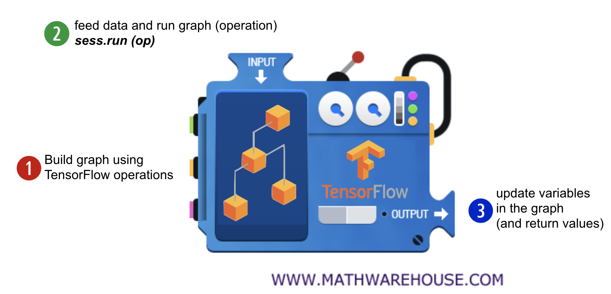
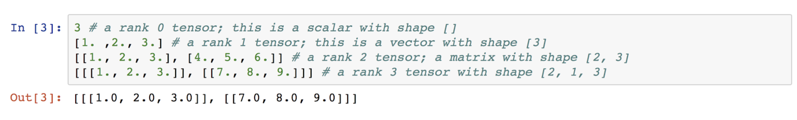
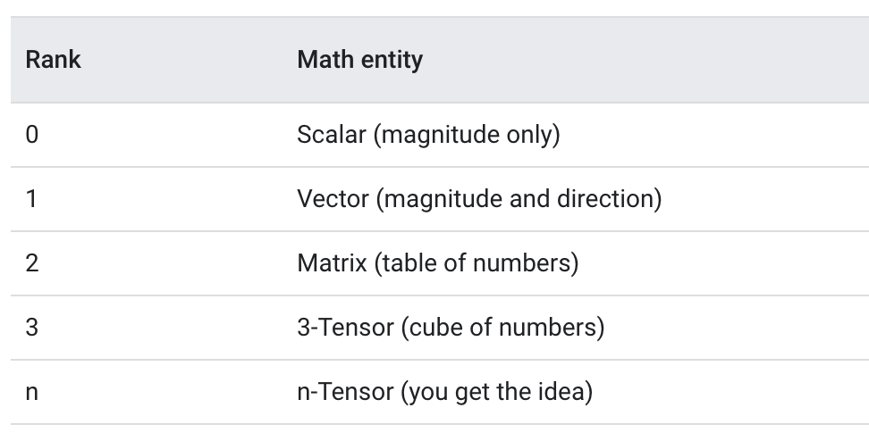
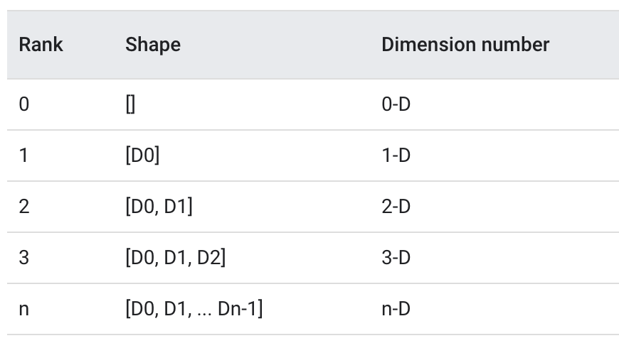

# ML Lab 01
### TensorFlow 기초
-------
### TensorFlow?
* TensorFlow 는 Data-Flow Grapth 를 사용해서 수학적인 계산을 하는 라이브러리!
* Python 사용가능1
---------
### Data Flow Graph

* Nodes in the graph represent mathematical operations
  * 노드들(원 같은거)은 계산 단위(더하기, 곱셈..)를 나타낸다. 
* Edges represent the multidimensional data arrays (tensors) communicated between them
  * 엣지(선)는 계산에 의해 소비되거나 생성된 데이터를 나타낸다.
---------
### Hello TensorFlow! --> Constant Node
```Python
import tensorflow as tf

hello = tf.constant("Hello TensorFlow!") # 노드를 생성
sess = tf.Session() # 세션을 생성

print(sess.run(hello)) #세션에서 노드를 실행!
```

### Computational Node
```python
# 'Hello TensorFlow' 코드를 기반으로
node1 = tf.constant(1.2)
node2 = tf.constant(2, tf.float32) # tf.add는 같은 속성만 더할 수 있나?
node3 = tf.add(node1, node2)

print(sess.run([node1, node2]), sess.run(node3))
# 아하! TensorFlow 는 보통의 코딩과는 다르게 작동하는구나!
```

### Placeholder Node
```python
n1 = tf.placeholder(tf.float32) # 값을 Run 할때 넣어주는법!
n2 = tf.placeholder(tf.float32) # placeholder(타입) 이렇게 넣어주면된다!

add = n1 + n2

print(sess.run(add, feed_dict={n1: 3, n2: 4.4}))
print(sess.run(add, feed_dict={n1: [2, 3, 4], n2: [1.2, 2.2, 0.1]}))
# 여러개도 한번에 계산이 되내!
```
----------
### TensorFlow 작동방식

1. graph 를 만들자!
   * 노드를 만들고, 세션을 만들고 ...
2. 데이터를 받아서 실행하자!
   * `sess.run(op, feed_dict={x: x_data})`
3. graph 가 실행되며 변수를 update 하거나 값을 반환한다!

----------
----------
----------
### Tensor??

#### 여기에 나온 `Array` 들이 `Tensor`

### Rank!

#### 쉽게 말하면 `차원`! --> 1차원,, 2차원,, 3차원...

### Shape!

#### 각 차원(Rank)에 들어있는 `요소의 수` 를 `Shape` 라고함!


### Type!
* TensorFlow 에는 많은 타입이 있음.
* 하지만 `tf.float32`를 많이 사용함!

> #### Why `tf.float32`?
> [Link](https://www.quora.com/When-should-I-use-tf-float32-vs-tf-float64-in-TensorFlow)\
> 많은 용량의 데이터를 사용하며, GPU 메모리상의 문제가 있어 주로 `float32`를 사용한다.\
> `float64`가 정확도가 더 좋지만 큰 차이는 없다.


참고 : [Tensor의 기본 개념](https://blog.naver.com/PostView.nhn?blogId=complusblog&logNo=221237818389&parentCategoryNo=&categoryNo=220&viewDate=&isShowPopularPosts=false&from=postView)