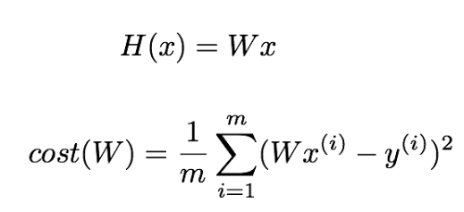
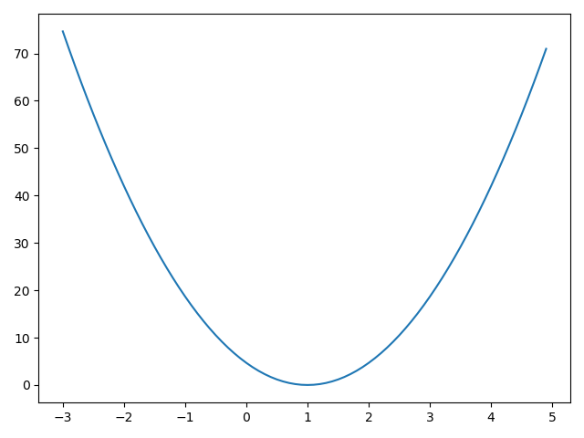

# ML Lab 03
### Linear Regression 의 Cost 최소화!
-------

#### 이 Cost 를 그래프로 확인해보자!
```python
import tensorflow as tf
import matplotlib.pyplot as plt

X = [1, 2, 3]
Y = [1, 2, 3]

W = tf.placeholder(tf.float32)

hypothesis = X * W

cost = tf.reduce_mean(tf.square(hypothesis - Y))

W_history = []
cost_history = []

with tf.Session() as sess:
    for i in range(-30, 50):
        curr_W = i * 0.1
        curr_cost = sess.run(cost, feed_dict={W: curr_W})

        W_history.append(curr_W)
        cost_history.append(curr_cost)
plt.plot(W_history, cost_history)
plt.show()
```

#### 흠 한곳에 수렴하는 모양을 가지는군 -> Cost 가 가장 작을때의 W 가 정답
```python
import tensorflow as tf

tf.set_random_seed(777) 

x_data = [1, 2, 3]
y_data = [1, 2, 3]

W = tf.Variable(tf.random_normal([1]), name="weight")
X = tf.placeholder(tf.float32)
Y = tf.placeholder(tf.float32)

hypothesis = X * W
cost = tf.reduce_mean(tf.square(hypothesis - Y))

# Minimize: Gradient Descent using derivative: W -= learning_rate * derivative
learning_rate = 0.1
gradient = tf.reduce_mean((W * X - Y) * X)
descent = W - learning_rate * gradient
update = W.assign(descent)

with tf.Session() as sess:
    sess.run(tf.global_variables_initializer())

    for step in range(21):
        _, cost_val, W_val = sess.run(
            [update, cost, W], feed_dict={X: x_data, Y: y_data}
        )
        print(step, cost_val, W_val)

""" 결과값
0 6.8174477 [1.6446238]
1 1.9391857 [1.3437994]
2 0.5515905 [1.1833596]
3 0.15689684 [1.0977918]
4 0.044628453 [1.0521556]
5 0.012694317 [1.0278163]
6 0.003610816 [1.0148354]
7 0.0010270766 [1.0079122]
8 0.00029214387 [1.0042198]
9 8.309683e-05 [1.0022506]
10 2.363606e-05 [1.0012003]
11 6.723852e-06 [1.0006402]
12 1.912386e-06 [1.0003414]
13 5.439676e-07 [1.000182]
14 1.5459062e-07 [1.000097]
15 4.3941593e-08 [1.0000517]
16 1.2491266e-08 [1.0000275]
17 3.5321979e-09 [1.0000147]
18 9.998237e-10 [1.0000079]
19 2.8887825e-10 [1.0000042]
20 8.02487e-11 [1.0000023]
"""
```
#### 너무 느린걸... Gradient Descent 를 한번 써볼까?
```python
# Lab 3 Minimizing Cost
import tensorflow as tf

# tf Graph Input
X = [1, 2, 3]
Y = [1, 2, 3]

# Set wrong model weights
W = tf.Variable(5.0)

# Linear model
hypothesis = X * W

# cost/loss function
cost = tf.reduce_mean(tf.square(hypothesis - Y))

# Minimize: Gradient Descent Optimizer
train = tf.train.GradientDescentOptimizer(learning_rate=0.1).minimize(cost)

# Launch the graph in a session.
with tf.Session() as sess:
    # Initializes global variables in the graph.
    sess.run(tf.global_variables_initializer())

    for step in range(101):
        _, W_val = sess.run([train, W])
        print(step, W_val)

""" 결과값 -> 금방 적용된다!
0 1.2666664
1 1.0177778
2 1.0011852
3 1.000079
4 1.0000052
5 1.0000004
6 1.0
7 1.0
8 1.0
9 1.0
10 1.0
"""
```


> 내용추가 필요! -> 책을 보고 내용 추가하자!