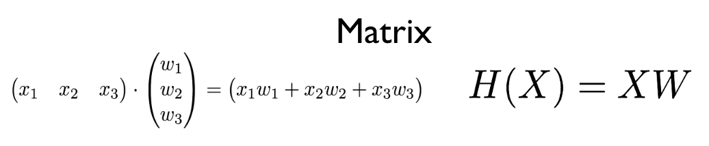

# ML Lab 04
### Multi-Variable Linear Regression + Loading Data from File
-------
#### Multi-Variable Linear Regression
> 중간, 기말고사 성적만 있을 때 대학합격을 예측하기 쉬울까? or 모의고사 성적도 있을때 쉬울까?
> #### 당연히 모의고사 성적도 있을때지! --> 요소가 많으면 많을수록 예측하기 쉬어진다!

```python
import tensorflow as tf
tf.set_random_seed(777)  

x1_data = [73., 93., 89., 96., 73.] # Float으로 받아오기 때문에 00. 이런모습
x2_data = [80., 88., 91., 98., 66.]
x3_data = [75., 93., 90., 100., 70.]

y_data = [152., 185., 180., 196., 142.]

x1 = tf.placeholder(tf.float32)
x2 = tf.placeholder(tf.float32)
x3 = tf.placeholder(tf.float32)

Y = tf.placeholder(tf.float32)

w1 = tf.Variable(tf.random_normal([1]), name='weight1')
w2 = tf.Variable(tf.random_normal([1]), name='weight2')
w3 = tf.Variable(tf.random_normal([1]), name='weight3')
b = tf.Variable(tf.random_normal([1]), name='bias')

hypothesis = x1 * w1 + x2 * w2 + x3 * w3 + b # 위의 이미지 식

cost = tf.reduce_mean(tf.square(hypothesis - Y)) # Cost 계산

optimizer = tf.train.GradientDescentOptimizer(learning_rate=1e-5)
# Gradient Descent 사용 + 학습률은 0.00001
train = optimizer.minimize(cost)
# train -> optimizer(Gradient Descent) 를 사용해서 cost를 최소화 해라!

sess = tf.Session()
sess.run(tf.global_variables_initializer())

for step in range(2001):
    cost_val, hy_val, _ = sess.run([cost, hypothesis, train],
                                   feed_dict={x1: x1_data, x2: x2_data, x3: x3_data, Y: y_data})
    if step % 10 == 0: # 10 번째 마다 결과값 출력!
        print(step, "Cost: ", cost_val, "\nPrediction:\n", hy_val)


'''
결과!

1990 Cost:  4.9197
Prediction:
 [ 148.15084839  186.88632202  179.6293335   195.81796265  144.46044922]
2000 Cost:  4.89449
Prediction:
 [ 148.15931702  186.8805542   179.63194275  195.81971741  144.45298767]

# 거의 비슷하게 예측했지?
'''
```

> 좋아, 좋아! --> 근데 변수 넣기가 좀 힘들걸 --> case가 늘어날 때 마다 하나씩 추가하기가 힘들어
> #### 그러면 Matrix 를 사용해 볼까?



```python
import numpy as np
import tensorflow as tf

tf.set_random_seed(777)

xy = np.loadtxt('DeepLearningZeroToAll-master/data-01-test-score.csv', delimiter=',', dtype=np.float32)
# Numpy 사용!
# 파일을 불러온다! -> ',' 로 구분되어 있고 각 변수는 float32 타입이다

x_data = xy[:, 0:-1]
y_data = xy[:, [-1]]
# Python, Numpy 슬라이싱 방법을 공부하자!

print(x_data, "\nx_data shape:", x_data.shape)
print(y_data, "\ny_data shape:", y_data.shape)

# Check
input()

X = tf.placeholder(tf.float32, shape=[None, 3])
Y = tf.placeholder(tf.float32, shape=[None, 1])

W = tf.Variable(tf.random_normal([3, 1]), name='weight')
b = tf.Variable(tf.random_normal([1]), name='bias')

hypothesis = tf.matmul(X, W) + b

cost = tf.reduce_mean(tf.square(hypothesis - Y))

optimizer = tf.train.GradientDescentOptimizer(learning_rate=1e-5)
train = optimizer.minimize(cost)

sess = tf.Session()
sess.run(tf.global_variables_initializer())

for step in range(2001):
    cost_val, hy_val, _ = sess.run([cost, hypothesis, train], feed_dict={X: x_data, Y: y_data})
    if step % 10 == 0:
        print(step, "Cost:", cost_val, "\nPrediction:\n", hy_val)

# Check
input()

# 학습된 hypothesis 모델을 가지고 내 예상 점수를 확인!
print("Your score will be ", sess.run(hypothesis, feed_dict={X: [[100, 70, 101]]}))
# 여러개를 한번에 물어 볼수도 있음
print("Other scores will be ", sess.run(hypothesis, feed_dict={X: [[60, 70, 110], [90, 100, 80]]}))
```