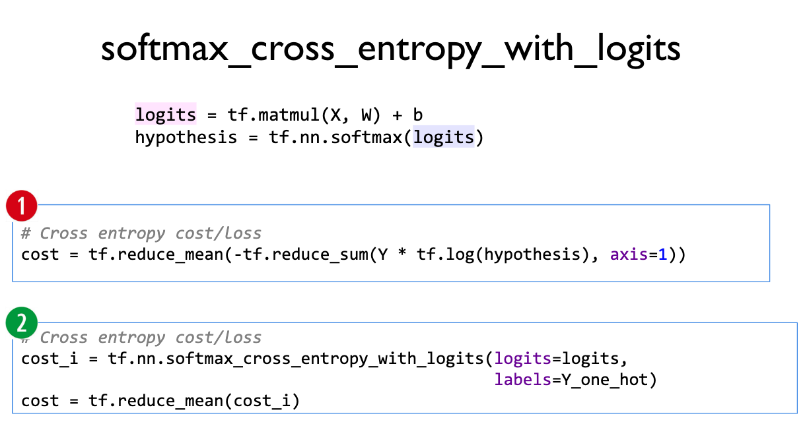

# ML Lab 06
### Softmax Classification 구현 + Fancy Softmax Classification 구현!
-------
```python
import tensorflow as tf

tf.set_random_seed(777)

x_data = [[1, 2, 1, 1],
          [2, 1, 3, 2],
          [3, 1, 3, 4],
          [4, 1, 5, 5],
          [1, 7, 5, 5],
          [1, 2, 5, 6],
          [1, 6, 6, 6],
          [1, 7, 7, 7]]

y_data = [[0, 0, 1],
          [0, 0, 1],
          [0, 0, 1],
          [0, 1, 0],
          [0, 1, 0],
          [0, 1, 0],
          [1, 0, 0],
          [1, 0, 0]]

X = tf.placeholder("float", [None, 4])
Y = tf.placeholder("float", [None, 3])
nb_classes = 3

W = tf.Variable(tf.random_normal([4, nb_classes]), name='weight')
b = tf.Variable(tf.random_normal([nb_classes]), name='bias')

# tf.nn.softmax 은 softmax 과정을 해준다!
# softmax = exp(logits) / reduce_sum(exp(logits), dim) --> 똑같은 식!
hypothesis = tf.nn.softmax(tf.matmul(X, W) + b)

# Softmax 의 Cost 식을 이용해서 만들어버려!
cost = tf.reduce_mean(-tf.reduce_sum(Y * tf.log(hypothesis), axis=1))

# GradientDescent 사용!
optimizer = tf.train.GradientDescentOptimizer(learning_rate=0.1).minimize(cost)

with tf.Session() as sess:
    sess.run(tf.global_variables_initializer())

    for step in range(2001):
        _, cost_val = sess.run([optimizer, cost], feed_dict={X: x_data, Y: y_data})

        if step % 200 == 0:
            print(step, cost_val)

    print('--------------')
    # 테스트!!!!
    a = sess.run(hypothesis, feed_dict={X: [[1, 11, 7, 9]]})
    print(a, sess.run(tf.argmax(a, 1)))

    print('--------------')
    b = sess.run(hypothesis, feed_dict={X: [[1, 3, 4, 3]]})
    print(b, sess.run(tf.argmax(b, 1)))

    print('--------------')
    c = sess.run(hypothesis, feed_dict={X: [[1, 1, 0, 1]]})
    print(c, sess.run(tf.argmax(c, 1)))

    print('--------------')
    all = sess.run(hypothesis, feed_dict={X: [[1, 11, 7, 9], [1, 3, 4, 3], [1, 1, 0, 1]]})
    print(all, sess.run(tf.argmax(all, 1)))

'''
0 6.926112
200 0.60050154
400 0.47295803
600 0.37342966
800 0.2801839
1000 0.23280522
1200 0.21065351
1400 0.19229898
1600 0.17682323
1800 0.16359563
2000 0.15216146
--------------
[[1.3890452e-03 9.9860197e-01 9.0613094e-06]] [1]
--------------
[[0.9311919  0.0629022  0.00590593]] [0]
--------------
[[1.2732791e-08 3.3411323e-04 9.9966586e-01]] [2]
--------------
[[1.3890452e-03 9.9860197e-01 9.0613185e-06]
 [9.3119192e-01 6.2902182e-02 5.9059174e-03]
 [1.2732791e-08 3.3411323e-04 9.9966586e-01]] [1 0 2]
'''
```


```python
import numpy as np
import tensorflow as tf

tf.set_random_seed(777)

xy = np.loadtxt('DeepLearningZeroToAll-master/data-04-zoo.csv', delimiter=',', dtype=np.float32)

x_data = xy[:, 0:-1]
y_data = xy[:, [-1]]

print(x_data.shape, y_data.shape)

'''
(101, 16) (101, 1)
'''

nb_classes = 7

X = tf.placeholder(tf.float32, [None, 16])
# 0 에서 6 가지의 값중 한가지가 답!
Y = tf.placeholder(tf.int32, [None, 1])

Y_one_hot = tf.one_hot(Y, nb_classes)
# one_hot 을 사용하면 차원이 늘어나버려!
print("one_hot:", Y_one_hot)
Y_one_hot = tf.reshape(Y_one_hot, [-1, nb_classes])
# 차원을 다시 원래대로 줄여버리자!
print("reshape one_hot:", Y_one_hot)

'''
one_hot: Tensor("one_hot:0", shape=(?, 1, 7), dtype=float32)
reshape one_hot: Tensor("Reshape:0", shape=(?, 7), dtype=float32)
'''

W = tf.Variable(tf.random_normal([16, nb_classes]), name='weight')
b = tf.Variable(tf.random_normal([nb_classes]), name='bias')

# 똑같은 식이다!
# softmax = exp(logits) / reduce_sum(exp(logits), dim)
logits = tf.matmul(X, W) + b
hypothesis = tf.nn.softmax(logits)

# 후.. 힘든걸!
cost = tf.reduce_mean(tf.nn.softmax_cross_entropy_with_logits_v2(logits=logits, labels=tf.stop_gradient([Y_one_hot])))
optimizer = tf.train.GradientDescentOptimizer(learning_rate=0.1).minimize(cost)

prediction = tf.argmax(hypothesis, 1)
correct_prediction = tf.equal(prediction, tf.argmax(Y_one_hot, 1))
accuracy = tf.reduce_mean(tf.cast(correct_prediction, tf.float32))

# Launch graph
with tf.Session() as sess:
    sess.run(tf.global_variables_initializer())

    for step in range(2001):
        _, cost_val, acc_val = sess.run([optimizer, cost, accuracy], feed_dict={X: x_data, Y: y_data})

        if step % 100 == 0:
            print("Step: {:5}\tCost: {:.3f}\tAcc: {:.2%}".format(step, cost_val, acc_val))

    # 테스트테스트!
    pred = sess.run(prediction, feed_dict={X: x_data})
    # zip() 함수는 List 를 앞에서부터 짝지어줌 -> pred[1] - p 라면 y-data.flatten()[1] - y 이런식으로!
    for p, y in zip(pred, y_data.flatten()):
        print("[{}] Prediction: {} True Y: {}".format(p == int(y), p, int(y)))

'''
Step:     0 Loss: 5.106 Acc: 37.62%
Step:   100 Loss: 0.800 Acc: 79.21%
Step:   200 Loss: 0.486 Acc: 88.12%
...
Step:  1800	Loss: 0.060	Acc: 100.00%
Step:  1900	Loss: 0.057	Acc: 100.00%
Step:  2000	Loss: 0.054	Acc: 100.00%
[True] Prediction: 0 True Y: 0
[True] Prediction: 0 True Y: 0
[True] Prediction: 3 True Y: 3
...
[True] Prediction: 0 True Y: 0
[True] Prediction: 6 True Y: 6
[True] Prediction: 1 True Y: 1
'''
```