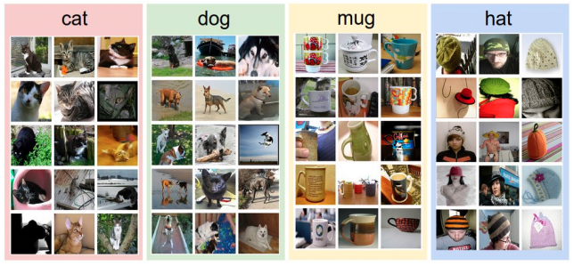
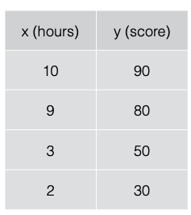
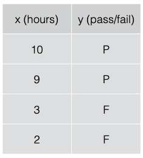
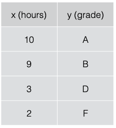

# ML Lecture 01
### 기본적인 ML 의 용어와 개념 설명

* What is ML?
* What is learning?
  * supervised
  * unsupervised
* What is regression?
* What is classification?

----------
### Machine Learning?
* Explicit Programming 의 한계!
  * 예시 : 스팸메일 필터 --> 규칙으로 구분하기에는 규칙을 정하기가 너무 힘들다!
  * 예시 : 자율주행 자동차 ---> 스팸메일보다 더 많아;;
* Arthur Samuel(1959)
  * 하나하나 프로그래밍하지말고 자료나 현상에서 자동적으로 배우면 안되?? --> 머신러닝!!
----------
### Supervised / Unsupervised Learning
* Unsupervised Learning
  * 비슷한 단어를 모아라! or 뉴스와 같이 미리 레이블을 정해주기 힘들면? --> 데이터를 가지고 직접 구분!
* Supervised Learning
  * 레이블링이 되있는 데이터(Traning set)을 가지고 학습하는 것!
  * > 
    > `--> 이미 구별되어 있음!`
  * Most common problem type in ML
    * 이미지처리! --> 이미 구별된 이미지에서 학습
    * 이메일 스팸처리! --> 이미 구별된 이메일에서 학습
    * 시험점수 예측! --> 전 시험의 점수와 공부한 시간으로 학습
> #### Traing Data Set
> |    데이터     | 레이블 값 |
> | :--------: | :---: |
> | 1,2,3,4... |   5   |
> | 2,5,2,1... |   1   |
> | 6,2,8,1... |   9   |
> 이런걸 말함 (데이터와 그에 맞는 레이블 값이 이미 있어!)

* Types of supervised learning
  * 시험점수 예측 시스템 with 공부한 시간으로 --> `Regression`
    * 이런모델이 필요할꺼야!
    * 
  * 점수가 아니라 Pass / Fail 로 나누면? --> `Binary classification`
    * 두 개중 하나를 고르는 것이기 때문에 `Binary`
    * 이런모델이 필요할꺼야!
    * 
  * 그러면 A / B / C / D / E 로 나누면? --> `multi-label classfication`
    * 여러개가 있으니 `Multi-label`
    * 이런모델이 필요할꺼야!
    * 