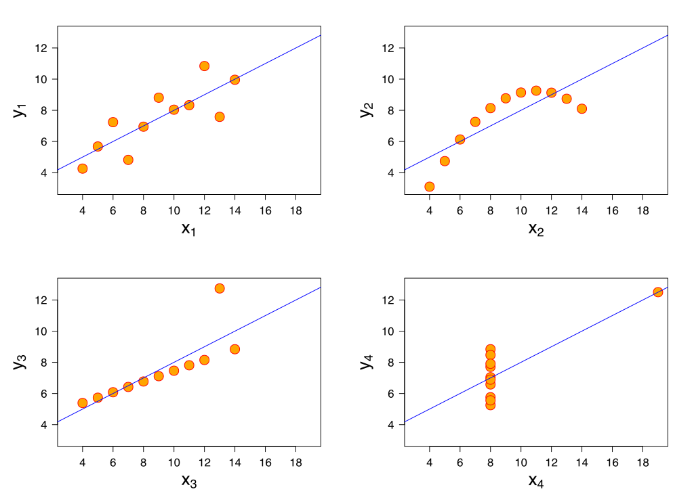

# ML Lecture 02
### Linear Regression -- 선형회귀
* 머신러닝 알고리즘을 공부하며 쉽게 이해할 수 있는 알고리즘중 하나
* 
* 이러한 점들(데이터)을 관통하는 하나의 직선을 찾아내는 것!
------------
### Hypothesis -- 가설
* Linear Regression 은 데이터을 관통하는 `직선`을 찾아내는 것이 목표!
* 즉 $H(x) = Wx + b$ 이러한 함수로 표현할 수 있음.
* $W$ 와 $b$ 의 값을 찾는것이 목표이다.

### `Which hypothesis is better?`

* RED, BLUE, YELLOW 선중 어떤선이 `가장 데이터를 잘 표현`하고 있을까?
* 그 직선을 찾아내는 방법중 하나가 `Cost Function (Lost Function)`

### Cost Function

* 실제 데이터(점) 과 예측한 선과의 차이를 계산하면 되겠지!
* 
* 목표 : cost(W,b) 를 `최소화`하는 것!

참고 : [Blog](http://it.plusblog.co.kr/221238399644)
