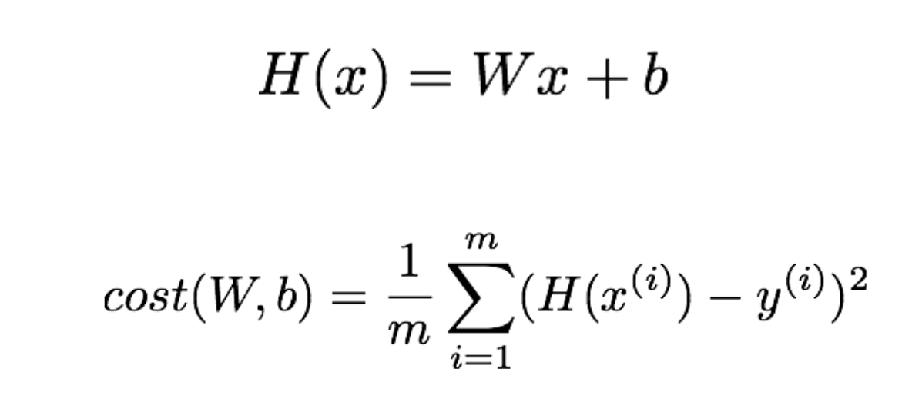

# ML Lecture 03
### Hypothesis and Cost

> 'Cost' 를 최소화 하는 W 와 b 를 구하는 것이 목표!

### Simplified hypothesis

> |   x   |   Y   |
> | :---: | :---: |
> |   1   |   1   |
> |   2   |   2   |
> |   3   |   3   |
> `W` 가 1, 2, 3 일 때의 cost(W)는?
> |   W   | Cost(W) |
> | :---: | :-----: |
> |   1   |    0    |
> |   0   |  4.67   |
> |   2   |  4.67   |
> #### 그래프를 그려보자!
> \
> 그래서 최소값을 어떻게 구하는데? -> Gradient descent algorithm

### Gradient descent algorithm
* Minimize cost function
* Gradient descent is used many minimization problems
* For a given cost function, cost (W, b), it will find W, b to minimize cost
* It can be applied to more general function: cost (w1, w2, …)
* How it Works?
  1. Start with initial guesses
     * Start at 0.0 or anywhere
     * Keep change `W` and `b` a little bit to try and reduce cost(W,b)
  2. Each time you change the parameters, you select the gradient which reduces cost(W, b) the most possible
  3. Repeat
  4. Do so until you converge to a local minimum

### Gradient descent 알고리즘
* cost 를 최소화 한다.
* 많은 최소화하는 문제에 사용된다.
* 주어진 cost function, cost(W, b) 는 최소화된 W, b 값을 찾을 것이다.
* 좀더 일반적인 상황에도 사용할 수 있다. : cost(w1, w2, ...)
* 어떻게 작동할까?
  1. 한점에서 시작!
     * 원점에서 시작하거나 아무곳에서도 시작 가능하다.
     * `W`와 `b` 값을 조금씩 바꾸고 cost(W,b)를 줄인다.
  2. 매개변수를 바꿀때마다 cost(W, b)를 최소화 할수 있을 것 같은 경사도(gradient)를 선택한다.
  3. 반복!
  4. local minimum 에 수렴될때까지 계속 진행한다!

> 어? 수렴값이 하나가 아니면 어떻하지?
### Convex function

> 엌.. 수렴부분이 2개라서 알고리즘 잘못쓰면 ㅈ될 듯\
> `Convex function` 인지 꼭 한번 확인하고 알고리즘을 적용하자!\
> 