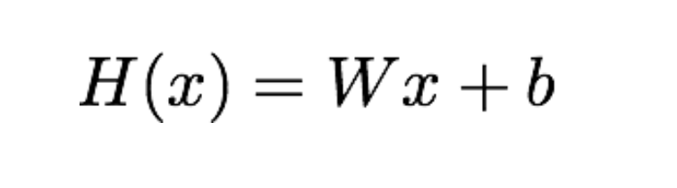
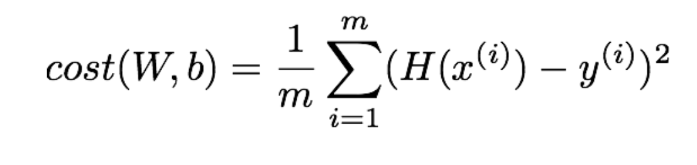
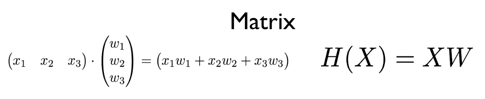

# ML Lecture 04
### Recap
* Hypothesis
  * 
* Cost function
  * 
* Gradient descent algorithm

> 이제 1개 의 Input이 있을때는 결과를 예측할 수 있어!

### Multi-variable linear regression

> 읔 식은 비슷한데 행렬이 나와버리네...

[행렬의 기초연산](https://ratsgo.github.io/linear%20algebra/2017/03/14/operations/)\
[EBS [수학영역] 수학 I - 행렬이란?](https://www.youtube.com/watch?v=QCJd8R8G1lk)\
[EBS [수학영역] 수학 I - 행렬의 곱셈이란?](https://www.youtube.com/watch?v=qwEWO-cQwXQ)\
[EBS [수학영역] 수학 I - 행렬에서의 덧셈, 뺄셈, 실수배의 특징은?](https://www.youtube.com/watch?v=m4quGRilsAY)\
[선형대수의 기초.pdf](files/선형대수의기초.pdf)
> 행렬 공부공부공부!!