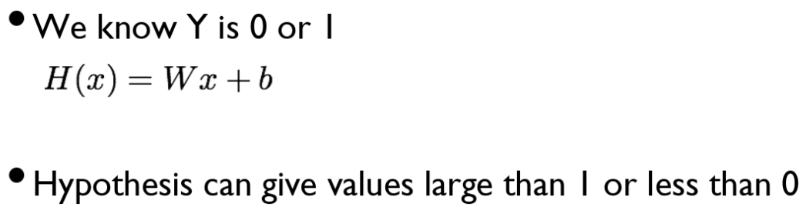
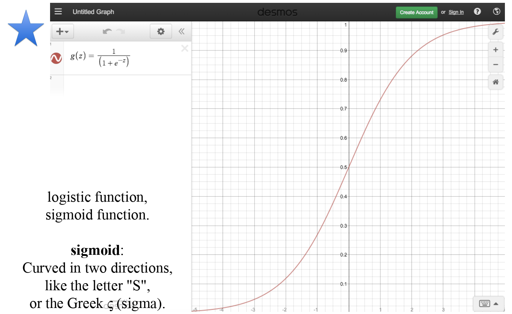
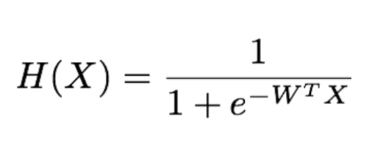
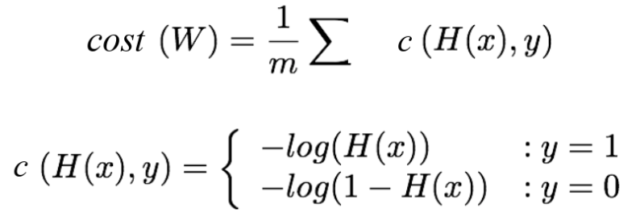
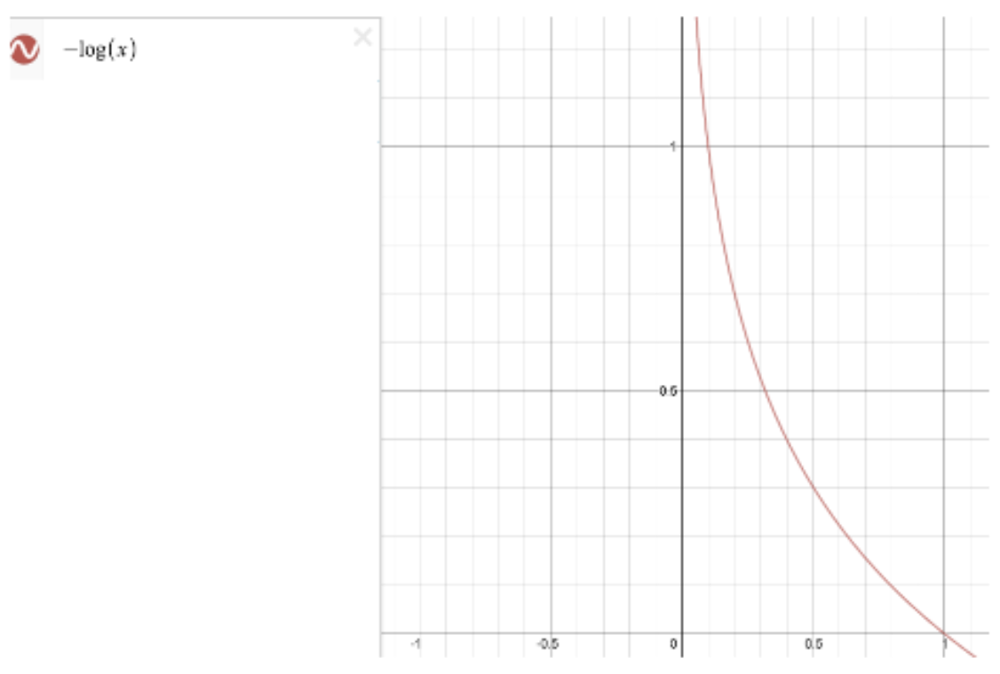
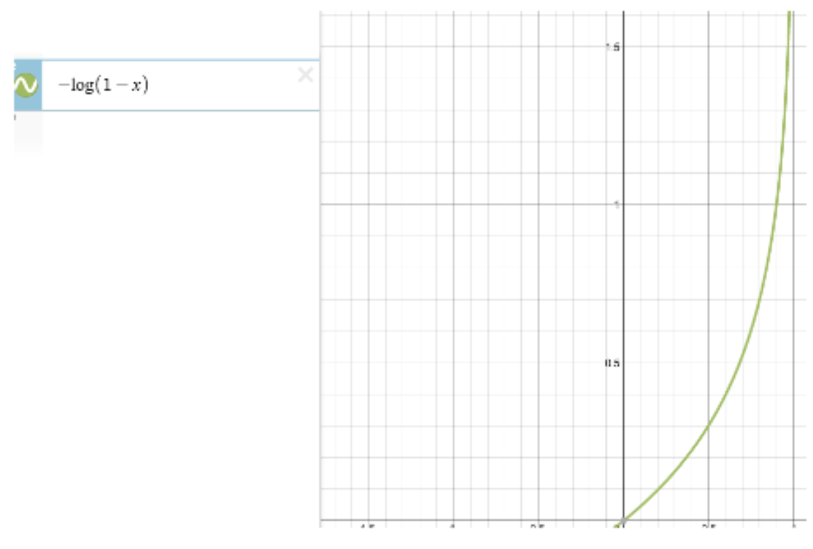
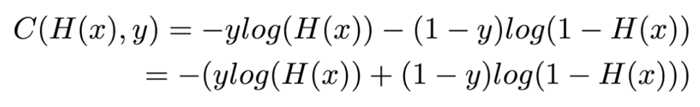
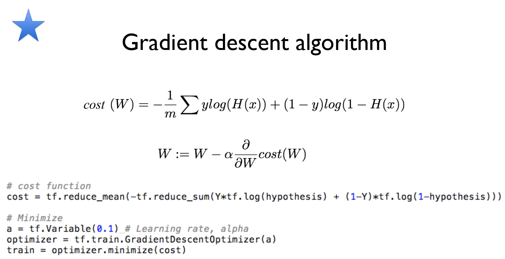

# ML Lecture 05
### Logistic Classification 의 가설 함수 정의 + cost 함수 설명
#### Classification
* Spam Detection: Spam or Ham
* Facebook feed: show or hide
* Credit Card Fraudulent Transaction detection: legitimate / fraud
* Radiology : What Tumor
* Finance : Buy / Sell
> 이것들을 원하는 것을 1로 원하지 않는 것을 0으로 인코딩후 사용!

#### 공부한 시간 정도에 대한 Pass / Fail
> #### 공부한 시간과 Pass / Fail 를 해놓고 Linear Regression 을 적용해 놓으면 구분 가능?
> No. 이상값이 나오면 구분 기준이 이상해져!
> 

#### Logistic Function

##### `이게바로 Sigmoid 함수!`
> 원하는 0 과 1 의 값 사이로 나온다!

#### Logistic Hypothesis

##### `Sigmoid 함수!`

#### Logistic Cost function

> #### 실제 값과 예측 값의 차이가 커지면 cost 가 매우 커짐!
> 
> --> 실제 값이 1 일때 cost 예상
> 
> --> 실제 값이 0 일때 cost 예상

> #### 이걸 조합하면 Cost 를 계산할 수 있다!
> 

#### Minimize cost - Gradient Descent
