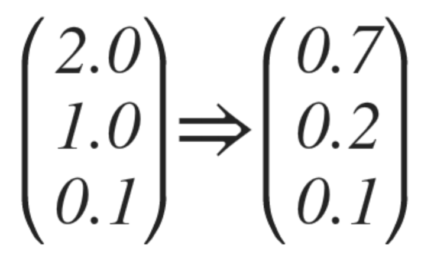

# ML Lecture 06
### Softmax Regression 기본 개념 + Softmax classifier 의 Cost 함수
#### Softmax Regression
> 
> #### A, B, C 그룹이 있을때 어떻게 분류하지?

> 
> A or Not, B or Not, C or Not 으로 분류해서 하면 되지 않나?

#### Hypothesis

> 행렬로 바꿔!
> 

> 이걸 보통 이렇게 나타냄!
> 

> 결과값!
> 
> Softmax 에 넣으면 이렇게 나온다! --> `합이 1`
> 

> #### 이걸 On Hot Encoding 을 하면 `(1, 0, 0)` 이런식으로 나타낼수 있다!

#### Cross-Entropy Cost Function

> `S` 는 예측값, `L`은 실제 분류값!

> 즉 정답을 맞추면 0의 Cost를 가지고, 정답을 맞추지 못하면 무한의 Cost를 가진다!