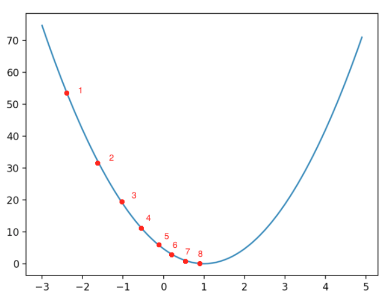
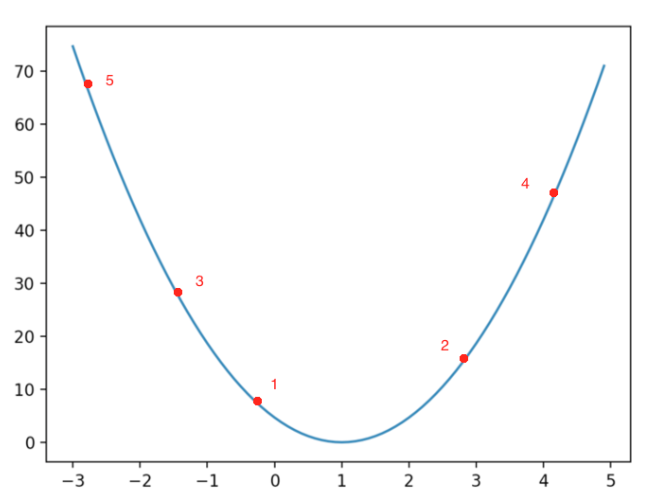
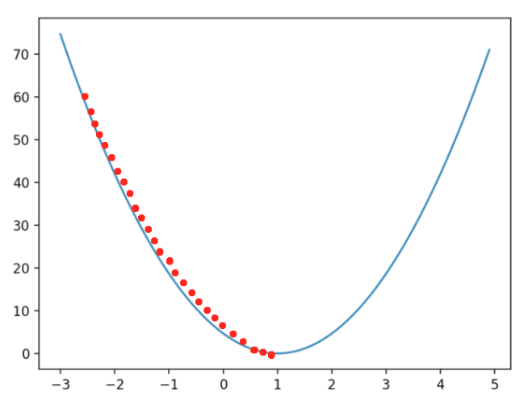
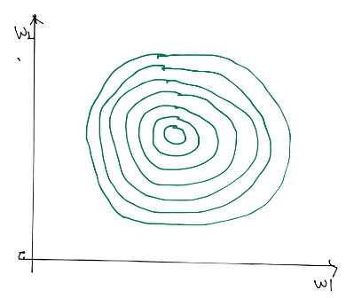
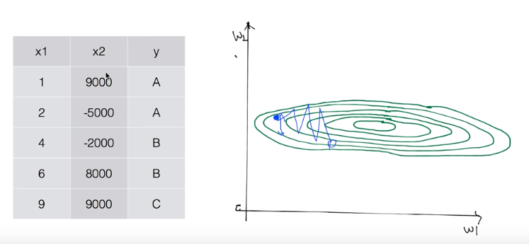
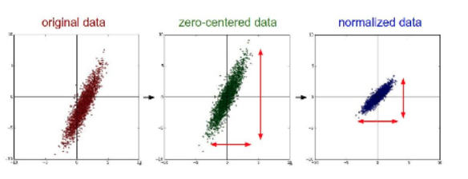
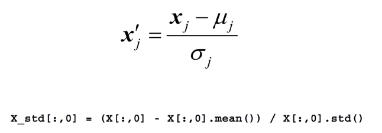
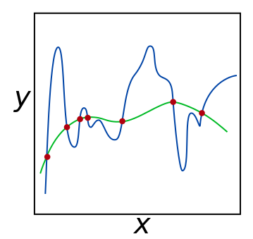
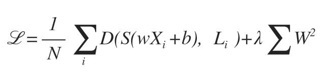
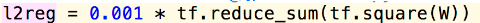

# ML Lecture 07
### 학습률(Learning Rate), Overfitting, Regularization
#### Learning Rate
> 
> 우리가 보통 알고 있는 Gradient Descent

> 
> Learning Rate 가 너무 크면 발산 (`OverShooting`) 이 일어나 버려!

> 
> Learning Rate 가 너무 작으면 학습이 너무 느려!

> #### 결정하는법!
> * 0.01 정도로 정한다!
> * 너무 느리거나 발산하면 값을 Change!

------------------
#### X Data 를 선처리 해야 하는 이유! -> 표준화!

* 이렇게 생기면 그냥 수행하다보면 가운데로 수렴!

* 이렇게 생기면 수렴하다가 갑자기 발산해버릴 수도 있어!

#### 표준화를 해주자!

* 보통 평균을 0 에 맞추고, 각축의 비율을 맞춰준다!

* 이렇게 말이야! -> 이 방법을 특별히 Standardization (표준화) 라고 한다!

------------
#### Overfitting, Regularization

> #### Overfitting
> * 학습이 너무 잘 되어서 학습 데이터에는 높은 정확도를 보이지만 실제 데이터에는 성능이 떨어지는 현상!
>
> #### 해결법!
> * 학습 데이터를 더 많이 쓰자!
> * Feature 의 개수를 줄이자! -> 노란 사과, 빨간 사과, 초록 사과 --> 사과로 통일!
> * Regularization 을 하자! 

> #### Regularization
> 
> * 구불구불 한 값을 직선에 가깝께 펴주는 것!
> 
> #### How?
> 
> * 여기서 람다 값을 키우면 Overfitting 을 많이 제어 하는것!
> * But, 너무 큰 람다 값은 학습을 방해해서 정확도를 떨어트릴 수도 있다!
> 
> 
> * 이렇게 구현할 수 있다!