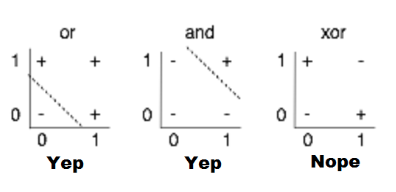
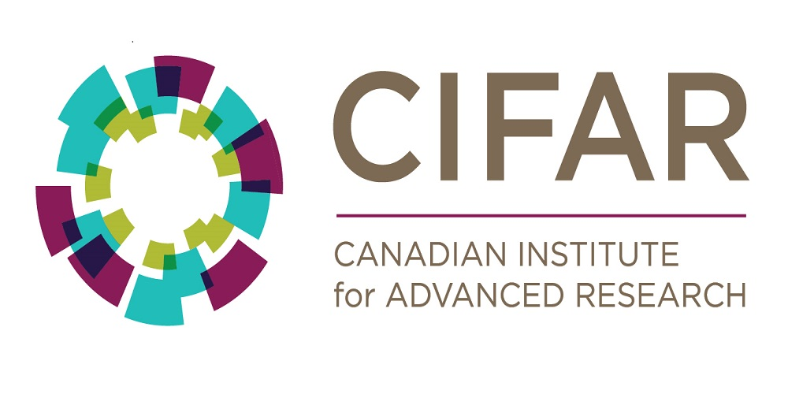

# ML Lecture 08
### 딥러닝의 기본 개념 : 시작과 XOR, Back-Propagation 과 2006/2007 '딥'의 출현
#### 딥러닝의 시작
> 뉴련이 작동 되는것을 보니까 엄청 간단하자나?\
> -> 한번 수학적으로 나타내 볼까?

* 다른 뉴런과 Synapse 를 통해 연결되고, 이런 연결로 입력이 들어온다.
* 입력들을 하나의 신호로 합친다음 외부의 출력으로 내보낸다.

-> 엌,, 입력값에 적당한 가중치를 곱하고 이 결과값 들을 잘 처리하면 ?!

-------

#### XOR 문제

* OR 문제와 AND 문제는 Linear 모델 한개로 분리가 가능하다!
  * 그림과 같이 하나의 직선으로 구분 가능함!
* 흠... XOR 문제는 안되는거 같은데?

> #### Marvin Minsky
> 하나의 모델을 이용해서 XOR 문제를 풀 수 없는건 맞아! --> 수학적으로 증명했음!

* 그러면, 모델을 하나만 쓰는게 아니라 여러개 쓰면 안됨? -> MLP
  * Multi Layer Perceptron
* 어 되겠다!!! -> 그런데 어떻게 학습함?
  * Marvin Minsky 왈, 'MLP 를 학습시킬 방법이 없어 ㅠㅠ'

-------

#### Backpropagation - 오차 역전파

* 기존 Neural Network 는 Forward 방향으로만 값이 전파됨.
  * 결과가 다를때 Layer 의 가중치를 조절하기가 힘들다!
* Backpropagation 는 Forward 방향으로 예측한 값이 실제와 다르면 Backward 방향으로 Error 를 전파시킴.
  * 그 Error 를 전파시키며 가중치를 보정해 나가자!

> #### 작동방식
> 1. 임이의 초기 가중치(W)를 주고 결과를 계산!
> 2. 계산 결과와 실제 값의 오차를 구하자!
> 3. 이 오차가 작아지는 방향으로 가중치를 업데이트!
> 4. 오차가 작아질 때까지 반복!

#### CNN - Convolutional Neural Networks

* 고양이의 특정 모양 인식 실험 -> 특정 뉴런만 반응하네?
  * 어? 신경의 일부분들이 그림의 부분을 나눠서 담당하고 나중에 합쳐지는거 아니야?
* 이 생각을 알고리즘으로 만들어 버려! -> CNN!
  * 참고 : [https://hamait.tistory.com/535](https://hamait.tistory.com/535)

#### Backpropagation 의 한계

* Backpropagation just not work well for normal neural nets with many layers
* Other rising machine learning algorithms : SVM, RandomForest, etc..
  * 1995 "Comparison of Learning Algorithms For Handwritten Digit Recognition" by LeCun et al. found this new approach worked better.

* 오차역전파는 많은 Layer 를 가진 Neural Network 에서는 잘 작동하지 않는다.
  * 왜? -> 거쳐가는 Layer 가 많아 질수록 역전파 되는 Error 의 흔적이 옅어지기 때문이다.
* 떠오르는 새로운 Learning Algorithm 이 나왔다. --> SVM, RandomForest....
  * CNN 을 고안한 LeCun 교수도 이러한 알고리즘이 Handwritten Digit Recognition 에서 CNN 보다 더 간단하고 더 성능이 좋게 나온다고 했다 ㅠㅠ

------------

#### CIFAR

* Canadian Institute for Advanced Research
* 당장 돈이 되거나 활용도가 없어도 연구를 할 수 있게 환경을 마련해 주는 단체 

#### Deeeeeeeep Learning!

* 2006년과 2007년 -> Hinton 과 Bengio
  * A fast learning algorithm for deep belief nets --- Hinton, Simon Osindero, and Yee-Whye In 2006
  * Greedy Layer-Wise Training of Deep Networks --- Yoshua Bengio et al. In 2007
* 핵심!
  * Neural networks with many layers really could be trained well, `if the weights are initalized in a clever way` rather than randomly.
  * Depp machine learning methods are more efficient for difficult problems than shallow methods.

> * 초기값이 잘 정해서 있다면, Layer 가 많은 Neural Network 라도 잘 학습된다!!!
> * 초기값의 중요도를 재확인 했고, Neural Networ 에 많은 Layer(Deep Learning) 를 두면 복잡한 문제를 효과적으로 풀 수 있다!!!

#### Deep Nets -> Deep Learning ---- 이름 바꾸기! 

----------

#### Image Net Challenge

* 사진을 주고 어떤 사진인지 맞추는 대회! -> 약 140 만개의 이미지를 주고 1000개의 대상을 식별해봐!
* 으... 맞추기 힘들어

* 2010년도에는 Error 률 30% 정도
  * 그 다음연도에도 비슷하네..
* 2012년 갑자기 16%!!!!
  * 뭐야, 뭐야 뭔일이야!
  * CNN 을 적용했기 때문!!
* 2015년에는 사람보다 이미지를 더 잘 인식해 버렸다!!

* CNN 뿐만 아니라 자연어 처리를 잘하는 RNN를 연결하면 그림을 설명할 수도 있어!

------------

#### 그 동안은 왜 못했지?? -- Hinton

* Our labeled datasets were thousands of times too small.
* Our computers were millions of times too slow.
* We initialized the weights in a stupid way.
* We used the wrong type of non-linearity.

> * 우리의 Dataset 들이 너무 적었어 ..
> * 우리의 컴퓨터가 너무 느렸어 ..
> * 우리는 가중치(Weights)를 멍청하게 정했어 ..
> * 우리는 Wrong Type of Non-Linearity 를 사용해서 망했어 ..