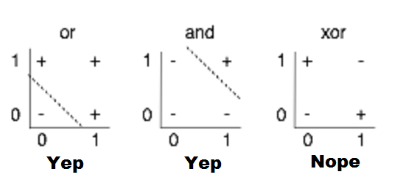
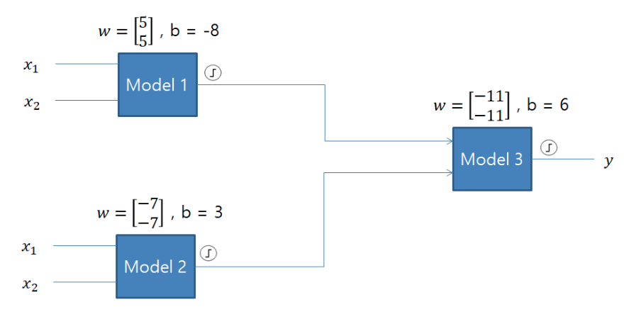
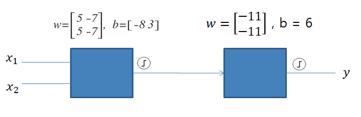
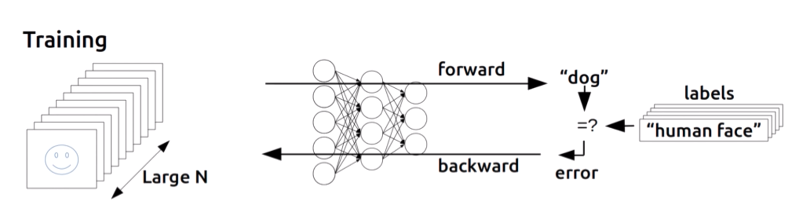

# ML Lecture 09
### Neural Nets for XOR, Backpropagation
#### Neural Nets for XOR


* 모델 한개로 분리가 불가능!!
* Neural Network 를 쓰면 된다!



> 각각은 다음을 나타낸다\
> 결과 = `sigmoid(x1*w + x2*w + b)`

|  x1   |  x2   | Model1 | Model2 | Model3 |
| :---: | :---: | :----: | :----: | :----: |
|   0   |   0   |   0    |   1    |   0    |
|   0   |   1   |   0    |   0    |   1    |
|   1   |   0   |   0    |   0    |   1    |
|   1   |   1   |   1    |   0    |   0    |

> 실제 XOR 연산을 구현해 냈다!\
> 행렬 연산으로 좀더 간단히 나타낼 수도 있다.



* 이를 Tensorflow 로 구현해본다면?
```python
Model1 = tf.sigmoid(tf.matmul(X, W1) + b1)
hypothesis = tf.sigmoid(tf.matmul(Model1, W2) + b2)
```

#### 좋아!! -> 그러면 어떻게 W 랑 Bias 값을 찾을까?


-------
#### Backpropagation


> #### Backpropagation
> * Paul Werbos, Hinton 에 의해 발견된 알고리즘
> * 결과값의 오류를 다시 이전 레이어로 전파하는 방식의 알고리즘

[수학적으로 어떻게 작동되는지 참고](http://it.plusblog.co.kr/221248822124)